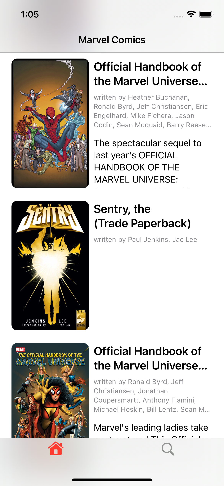
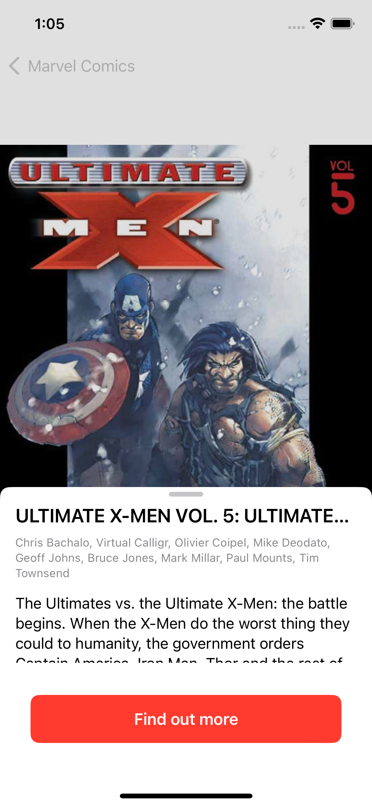
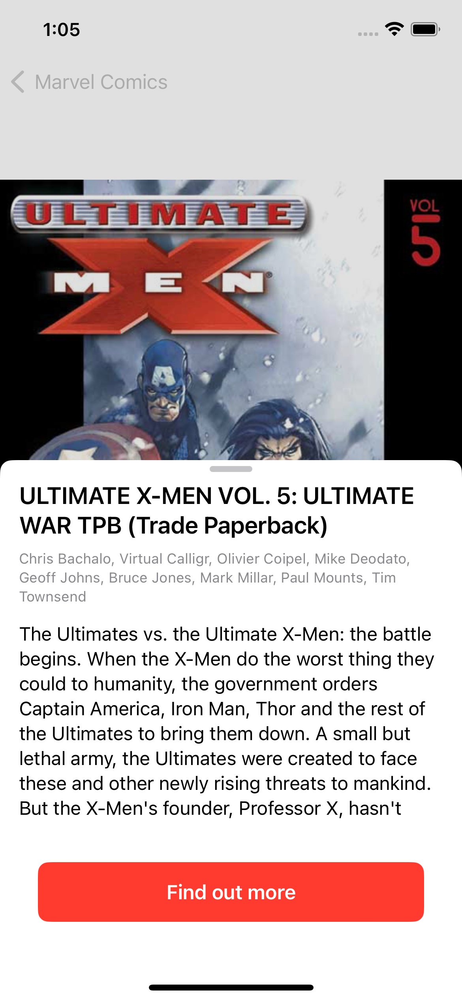
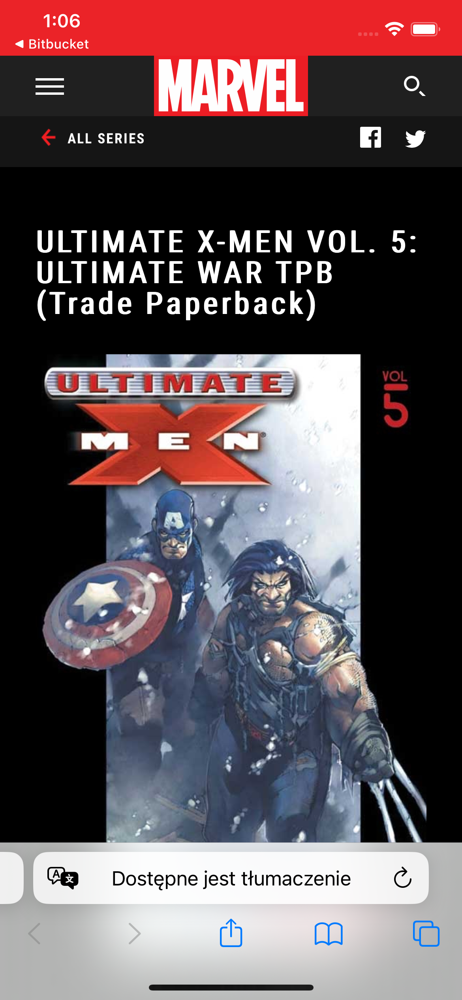
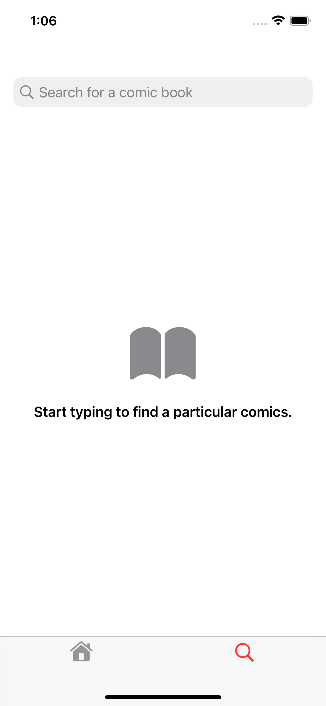
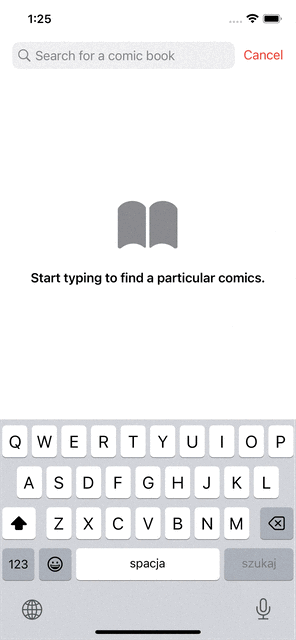
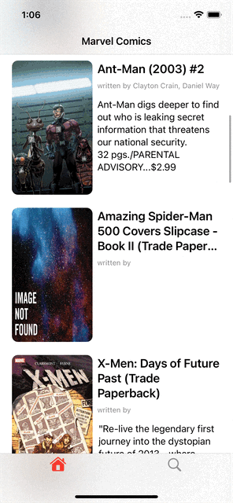

# MarvelApp
MarvelApp allows user to browse comic list and search for particular titles in another view. User can tap into desired comic entry and check detail information about it. If he desires to find
even further about it he can click into button which will open Safari's browser with even more data. Downloaded images are cached to not re-download the same data.
 
 
 

### Used Technologies:
1. SwiftUI - to create view layer of the application
2. SFSymbols - to borrow certain icons avaiable eg. in a navbar
3. Combine - to create asynchronous call to the API and store cached Images
 

### Design Patterns:
1. MVVM
2. Factory Method

### API
1. Used Marvel API - [a link](https://developer.marvel.com)
 

### Screenshots

#### Home screen

#### Comic detail screen

#### Comic Detail screen with expanded sheet

#### Comic entry in Safari browser

#### Empty search screen

#### Search screen in action

#### Home screen list in action

